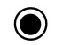
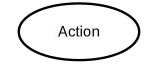
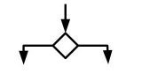
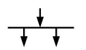
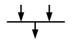
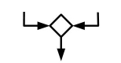

# Activity Diagram

***Activity Diagram &rarr; Behaviroal Design &rarr; UML Design***

## Table Of Content

### Overview

### What is the activity diagram

* **ACTIVITY DIAGRAM** is basically a flowchart to represent the flow from one activity to another activity.

* The activity can be described as an operation of the system.

* The basic purpose of activity diagrams is to capture the dynamic behavior of the system.. It is also called object-oriented flowchart.

* This UML diagram focuses on the execution and flow of the behavior of a system instead of implementation.

* Activity diagrams consist of activities that are made up of actions that apply to behavioral modeling technology.

---

### Components of Activity Diagram

* Activities
  * It is a behavior that is divided into one or more actions.
  * Activities are a network of nodes connected by edges.
  * There can be action nodes, control nodes, or object nodes.
    * Action nodes represent some action.
    * Control nodes represent the control flow of an activity.
    * Object nodes are used to describe objects used inside an activity.
  * Edges are used to show a path or a flow of execution.
  * Activities start at an initial node and terminate at a final node.

* Activity partition/swimlane
  * An activity partition or a swimlane is a high-level grouping of a set of related actions.
  * A single partition can refer to many things, such as classes, use cases, components, or interfaces.
  * If a partition cannot be shown clearly, then the name of a partition is written on top of the name of an activity.

* Fork and Join nodes
  * Using a fork and join nodes, concurrent flows within an activity can be generated.
  * A fork node has one incoming edge and numerous outgoing edges.
  * It is similar to one too many decision parameters.
  * When data arrives at an incoming edge, it is duplicated and split across numerous outgoing edges simultaneously.
  * A single incoming flow is divided into multiple parallel flows.

* Pins
  * An activity diagram that has a lot of flows gets very complicated and messy.
  * Pins are used to clearing up the things. It provides a way to manage the execution flow of activity by sorting all the flows and cleaning up messy thins.
  * It is an object node that represents one input to or an output from an action.

  * Both input and output pins have precisely one edge.

---

### Why use Activity Diagrams?

* Activity diagram in UML allows you to create an event as an activity which contains a collection of nodes joined by edges.
* An activity can be attached to any modeling element to model its behavior. Activity diagrams are used to model,
  * Use cases
  * Classes
  * Interfaces
  * Components
  * Collaborations
* Activity diagrams are used to model processes and workflows. The essence of a useful activity diagram is focused on communicating a specific aspect of a system’s dynamic behavior. Activity diagrams capture the dynamic elements of a system.

* Activity diagram is similar to a flowchart that visualizes flow from one activity to another activity. Activity diagram is identical to the flowchart, but it is not a flowchart. The flow of activity can be controlled using various control elements in the UML flow diagram. In simple words, an activity diagram is used to activity diagrams that describe the flow of execution between multiple activities.

### Activity Diagram Notations

* Activity diagrams symbols can be generated by using the following notations:

  * Initial states:
    * The starting stage before an activity takes place is depicted as the initial state.
    *  </img>
  
  * Final states:
    * The state which the system reaches when a specific process ends is known as a Final State.
    *  
  
  * State or an activity box:
    * 
  
  * Decision box: 
    * It is a diamond shape box which represents a decision with alternate paths. It represents the flow of control.
    * 
  
  * Fork:
    *   
  
  * Join:
    *  
  
  * Merge Node:
    *  

---

### How to draw an activity diagram?

  * Activity diagram is a flowchart of activities.
    * It represents the workflow between various system activities.
  
  * Activity diagrams are similar to the flowcharts, but they are not flowcharts.
  
  * Activity diagram is an advancement of a flowchart that contains some unique capabilities.
  
  * Activity diagrams include swimlanes, branching, parallel flow, control nodes, expansion nodes, and object nodes.

  * Activity diagram also supports exception handling.


  * To draw an activity diagram, one must understand and explore the entire system. All the elements and entities that are going to be used inside the diagram must be known by the user. The central concept which is nothing but an activity must be clear to the user. After analyzing all activities, these activities should be explored to find various constraints that are applied to activities. If there is such a constraint, then it should be noted before developing an activity diagram.

    * All the activities, conditions, and associations must be known.
    * Once all the necessary things are gathered, then an abstract or a prototype is generated, which is later converted into the actual diagram.

    * Following rules must be followed while developing an activity diagram,

      * All activities in the system should be named.
      * Activity names should be meaningful.
      * Constraints must be identified.
      * Activity associations must be known.

### Example of Activity Diagram

Let us consider mail processing activity as a sample for Activity Diagram.
    Following diagram represents activity for processing e-mails.

``` activity diagram ```
    In the above activity diagram, three activities are specified. When the mail checking process begins user checks if mail is important or junk. Two guard conditions [is essential] and [is junk] decides the flow of execution of a process. After performing the activity, finally, the process is terminated at termination node.```

---

### When Use Activity Diagram

    Activity diagram is used to model business processes and workflows. These diagrams are used in software modeling as well as business modeling.

    Most commonly activity diagrams are used to,

    Model the workflow in a graphical way, which is easily understandable.
    Model the execution flow between various entities of a system.
    Model the detailed information about any function or an algorithm which is used inside the system.
    Model business processes and their workflows.
    Capture the dynamic behavior of a system.
    Generate high-level flowcharts to represent the workflow of any application.
    Model high-level view of an object-oriented or a distributed system.

## Summary
    Activity diagram is also called as object-oriented flowcharts.
    Activity diagrams consist of activities that are made up of smaller actions.
    Activity is a behavior that is divided into one or more actions.
    It uses action nodes, control nodes and object nodes.
    An activity partition or a swimlane is a high-level grouping of a set of related actions.
    Fork and join nodes are used to generate concurrent flows within an activity.
    Activity diagram is used to model business processes and workflows.
